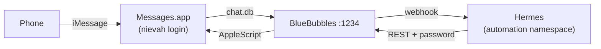

# iMessage for Hermes (BlueBubbles)

<!-- sources: scripts/macOS/bluebubbles, kubernetes/apps/hermes -->

Hermes reaches iMessage through [BlueBubbles Server](https://bluebubbles.app/) on the Mac mini.
BlueBubbles runs under a dedicated Standard macOS user, `nievah`, whose Messages app is signed
into the bot's own Apple Account. This page covers the Mac side. The Hermes side lives in
`kubernetes/apps/hermes`.



## Why a separate macOS user

BlueBubbles reads the running user's `chat.db` with Full Disk Access. It serves every
conversation and attachment over its API, and has Contacts and Find My routes too. Hermes
holds the API password, and so does every tool Hermes runs. Under a person's login, that
exposes their whole message history and their family's locations. The `nievah` user holds
only the bot's own conversations, and the person's own Messages on the Mac keeps working.
`configure-user.sh` refuses to run for an admin user. The decision record is
`.claude/decisions/2026-09-24-bluebubbles-dedicated-macos-user.md`.

## What to expect on macOS 26

| Limit | Why |
| --- | --- |
| BlueBubbles 1.9.9, from May 2025, is the newest release | Upstream is rewriting the server. Homebrew disabled the cask on 2026-09-01 because the app is not notarized. It is Developer ID signed, and `install.sh` pins the GitHub DMG by SHA-256 and signing team. |
| No typing indicator, tapbacks or read receipts, and Hermes can't start a chat | These need the Private API, which needs SIP disabled, and its helper is broken on macOS 26 ([#776](https://github.com/BlueBubblesApp/bluebubbles-server/issues/776)). Hermes replies in chats someone opened by texting the bot first. Cron delivery works once that chat exists. |
| AppleScript's fallback send fails | macOS 26 changed chat GUIDs from `iMessage;-;` to `any;-;` ([#777](https://github.com/BlueBubblesApp/bluebubbles-server/issues/777)). The primary send, to an existing chat, works. |
| Webhooks can stall on Apple Silicon | An idle Messages stops writing `chat.db`, and an open Messages window holds events back until someone clicks a chat ([#750](https://github.com/BlueBubblesApp/bluebubbles-server/issues/750)). The keep-alive agent below handles both. |

## Set up

The first two steps are manual: the scripts can't create accounts or type passwords.

1. **An Apple Account for the bot.** At account.apple.com, create one with a new email address
   you own. People text that address. Your own mobile number is fine for verification, since one
   number can verify several Apple Accounts. Keep the account out of Family Sharing, and never
   turn iCloud on with it.
2. **The `nievah` macOS user.** In *System Settings → Users & Groups → Add User*, create a
   Standard user with account name `nievah`. Log into it once and choose *Set Up Later* when
   Setup Assistant asks for an Apple Account. Then sign Messages, and only Messages, into the
   bot's Apple Account.
3. **The password, once.** From an admin login, at the repository root:

    ```bash
    openssl rand -hex 32 | tr -d '\n' | scripts/oci-vault-secrets.py -c firefly set bluebubbles-password
    ```

4. **Install**, from an admin login at the repository root. This installs the pinned app and
   stages the password for `nievah`:

    ```bash
    scripts/macOS/bluebubbles/install.sh --check
    scripts/macOS/bluebubbles/install.sh
    ```

    It reads the password from the vault, which needs `op` signed in. To skip the vault, pipe
    the password in instead.

5. **Configure**, in the `nievah` login, from Terminal:

    ```bash
    /Users/Shared/bluebubbles/configure-user.sh
    ```

    It opens System Settings at Full Disk Access and at Accessibility. Turn BlueBubbles on in
    both (this needs an admin password) and press Enter. Then click Allow or OK on the prompts
    that follow: the firewall, and `osascript` or BlueBubbles asking to control Messages. The
    script ends by printing the iMessage account BlueBubbles sees, which must be the bot's.
6. **Switch back to your own login** and leave `nievah` logged in.

`configure-user.sh` writes these files in the `nievah` home:

| File | Purpose |
| --- | --- |
| `~/bluebubbles.yml` | Settings BlueBubbles applies at every start: LAN only (no Cloudflare or ngrok tunnel), port 1234, keep the Mac awake, no auto-update, no Find My, Private API off |
| `config.db` `password` row | Written with `sqlite3` while BlueBubbles is stopped. BlueBubbles logs every value it applies from the YAML or its arguments, so the password never goes there. |
| `com.bluebubbles.server` LaunchAgent | Starts BlueBubbles at login and restarts it if it crashes. It is the same plist BlueBubbles writes itself. |
| `com.sargeant.messages-keepalive` LaunchAgent | Every 5 minutes, closes Messages' windows and asks Messages for its chat count |

## Operate

| Task | How |
| --- | --- |
| After a reboot | FileVault rules out auto-login. Log into your own account, then switch to `nievah` once and back. Its LaunchAgents start BlueBubbles and the keep-alive. |
| Check it from the LAN | `PW=$(scripts/oci-vault-secrets.py -c firefly get bluebubbles-password)`, then `curl -s "http://192.168.19.19:1234/api/v1/ping?password=$PW"` answers `pong` |
| Rotate the password | Set a new value (step 3), then rerun `install.sh` and `configure-user.sh`. Restart Hermes once its ExternalSecret has refreshed. |
| Upgrade BlueBubbles | Bump `BB_VERSION` and `BB_SHA256` in `install.sh`. Quit BlueBubbles in the `nievah` login, move the old app to the Trash, and rerun both scripts. |
| Change a setting | Edit the YAML in `configure-user.sh` and rerun it. A change made in BlueBubbles' own UI lasts only until its next start. |
| Logs | `~nievah/Library/Logs/bluebubbles-server/main.log` and `~nievah/Library/Logs/messages-keepalive.log` |

## What Hermes needs

| Setting | Value |
| --- | --- |
| `BLUEBUBBLES_SERVER_URL` | `http://192.168.19.19:1234`, the Mac mini's Ethernet address. It must stay reserved in DHCP. |
| `BLUEBUBBLES_PASSWORD` | vault-prod entry `bluebubbles-password` |
| `BLUEBUBBLES_ALLOWED_USERS` | The numbers and addresses allowed to talk to it. They are personal data, so keep them out of this public repository. |

!!! warning "Hermes registers its bind address as the webhook URL"
    Hermes registers `http://<BLUEBUBBLES_WEBHOOK_HOST>:<BLUEBUBBLES_WEBHOOK_PORT><path>?password=…`
    with BlueBubbles, and binds its listener to that same host. A wildcard or loopback host
    becomes `localhost`. There is no separate public URL setting, up to at least v2026.9.24. So
    the host must be both bindable inside the pod and reachable from the Mac. Otherwise the Mac
    posts every webhook to itself.
