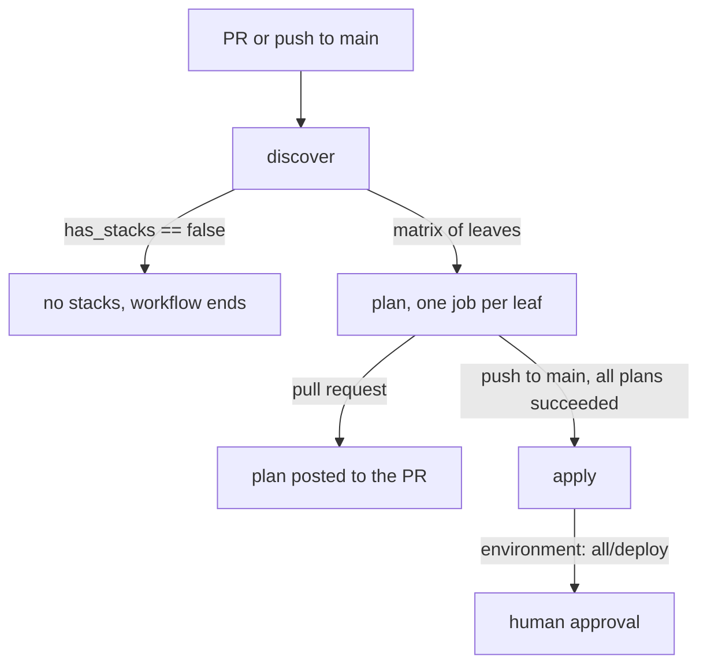

# Terraform delivery

<!-- sources: .github/workflows/terragrunt.yml, scripts/terragrunt-pipeline.sh, .github/workflows/terrateam.yml -->

Terraform changes reach the clouds through the **Terragrunt GitHub Actions workflow**. It
plans on every pull request that touches `terraform/**` and applies from `main` behind a
protected environment.

Atlantis used to do this job and was removed on 2026-09-16.

## Which system actually runs

| System | Where it's defined | State today |
| --- | --- | --- |
| Terragrunt workflow | `.github/workflows/terragrunt.yml` + `scripts/terragrunt-pipeline.sh` | **The gate.** Runs on every pull request touching `terraform/**`, plus a weekday drift schedule and `workflow_dispatch`. |
| Terrateam | `.github/workflows/terrateam.yml` | `workflow_dispatch` only, driven by the Terrateam backend. Not part of the normal path. |

## Why the workflow replaced Atlantis

Atlantis decided what to plan from each project's `when_modified` globs, which only saw that
project's own subtree. Edits to `terraform/root.hcl`, a `region.hcl`, or anything under
`terraform/modules/` change the rendered config of leaves that don't contain the edited file,
so those leaves were silently **not** planned and had to be triggered by hand.

`scripts/terragrunt-pipeline.sh` closes that gap. When a changed file matches the root
include, a shared module, or the pipeline itself, it replans **every** leaf rather than
trying to reason about which ones are affected.

## The pipeline script

The workflow is a thin wrapper around one script, kept separate so you can run exactly what
CI runs. That reproducibility is most of what made Atlantis failures hard to debug.

```bash
bash scripts/terragrunt-pipeline.sh discover all
```

| Subcommand | Arguments | Output |
| --- | --- | --- |
| `discover all` | none | Every leaf, one repo-relative path per line |
| `discover changed` | `<changed-files-file>` | Only the leaves affected by those files |
| `plan` | `<stack> <outdir>` | Writes `<outdir>/status` and `<outdir>/plan.txt` |
| `apply` | `<stack> <outdir>` | Writes `<outdir>/status` |
| `redact` | `<file>` | Strips sensitive-looking lines, to stdout |

`status` is one of `none`, `changes`, or `failed`.

A leaf is any directory with its own `terragrunt.hcl` that isn't the shared root include and
isn't inside a `.terragrunt-cache`. That cache exclusion matters: Terragrunt copies each
unit's `terragrunt.hcl` into the cache, so a naive `find` returns every leaf twice and CI
plans phantom stacks that vanish the moment the cache is cleared.

## Job flow



Three jobs, all on the `firefly-amd64` runner scale set:

- **`discover`** builds the matrix of leaves to plan. It carries a fork guard: pull requests
  from forks are skipped entirely, because the runners hold private cloud credentials.
- **`plan`** runs one job per leaf and posts the result to the pull request.
- **`apply`** runs only on `push` to `main`, only when every plan succeeded, and only inside
  the protected `all/deploy` environment, which is where the human approval lives. It runs
  `max-parallel: 1` with `fail-fast: false`.

!!! note "The runner name is not a label"
    `runs-on: firefly-amd64` is an actions-runner-controller **scale set name**, not a label
    array. ARC matches jobs to scale sets by name only, so `[self-hosted, Linux, X64]` would
    never be picked up even though those labels describe the runner accurately.

## Running a plan yourself

```bash
bash scripts/terragrunt-pipeline.sh discover all
bash scripts/terragrunt-pipeline.sh plan terraform/oci/prod/eu-amsterdam-1/network /tmp/out
cat /tmp/out/status
cat /tmp/out/plan.txt
```

To plan a single leaf directly, without the pipeline:

```bash
cd terraform/oci/prod/eu-amsterdam-1/network
terragrunt plan
```

## Verify

After a merge to `main`, check the run and the approval:

```bash
gh run list --workflow Terragrunt --limit 5
```

An apply that's waiting shows as in progress with the `all/deploy` environment pending
review. Approve it from the run page.

## Rollback

Revert the pull request and let the workflow apply the reverted state. There's no
out-of-band apply path: the protected environment is the only place credentials are handed
out, and applying from a laptop bypasses the approval that the environment exists to
enforce.
