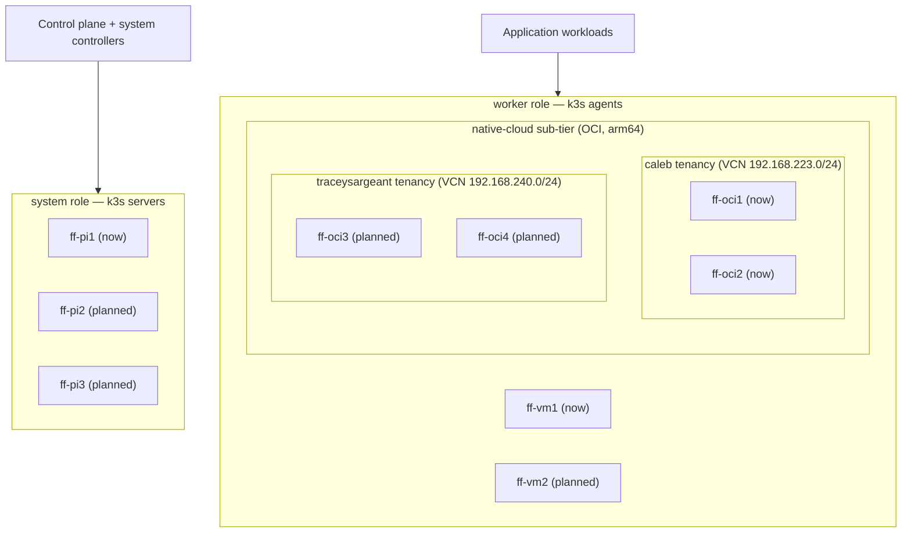

# Cluster Topology: system vs worker nodes

The firefly k3s cluster has two **node roles**, which map directly onto k3s's
server/agent split. Understanding this mapping is the key to deciding *where a
workload should run*.

## The two roles

| Role | k3s role | Runs | Current node(s) | Planned | Labels |
|------|----------|------|-----------------|---------|--------|
| **system** | k3s **server** (control plane) | API server, scheduler, controller-manager, kine **plus** the bootstrap- and network-critical controllers: flux-\*, cert-manager, external-secrets, 1Password Connect, external-dns, CoreDNS/Traefik | **ff-pi1** (Raspberry Pi 5, arm64, 8 GiB) | ff-pi2, ff-pi3 (more Pi5s: control-plane HA / more system capacity) | `node-role.kubernetes.io/system`, legacy `type=pi` / `node-role.kubernetes.io/pi` |
| **worker** | k3s **agent** | Application workloads, plus the policy engine and the operators whose workloads live here (kyverno, cloudnative-pg) | **ff-vm1** (amd64, 8 vCPU / 27.4 GiB allocatable); **ff-oci1** / **ff-oci2** (OCI free-tier, arm64, 2 OCPU / ~11.9 GiB allocatable, **caleb** tenancy: the **native-cloud** sub-tier, see below) | ff-vm2; **ff-oci3** / **ff-oci4** (same shape, **traceysargeant** tenancy) | `node-role.kubernetes.io/worker`, legacy `type=mini` / `node-role.kubernetes.io/mini`; native-cloud nodes also carry `topology.sargeant.co/tier=native-cloud` |

!!! info "The native-cloud pairs sit in two different OCI tenancies"
    `ff-oci1`/`ff-oci2` are in the **caleb** tenancy, `ff-oci3`/`ff-oci4` in
    **traceysargeant**. That boundary is the whole reason the second pair exists:
    one Oracle account gets one Always Free ARM allowance (4 OCPU / 24 GB), and
    ff-oci1 + ff-oci2 already spend all of firefly's. A second account carries a
    second allowance. The cost is that nothing crosses the boundary for free:
    separate credentials, separate DRG and IPSec tunnels, and a duplicated copy of
    the k3s node-token. See [The native-cloud tier](#the-native-cloud-tier-oci).



!!! note "Naming: pi == system, mini == worker"
    The repo historically named these roles after the **hardware** (`pi`, `mini`).
    They are now also exposed under **role-based** names (`system`, `worker`) which
    describe *intent* and survive hardware changes (e.g. an amd64 system node, or a
    Pi worker). The hardware names remain as **aliases** during migration. Prefer the
    role names for new and migrated workloads.

## Choosing where a workload runs

- **`system`**. The control plane, plus only what must keep working when *no worker
  does*: Flux (it installs everything else, so it cannot depend on anything else),
  cert-manager, the secrets plane (external-secrets + 1Password Connect), DNS and
  ingress, and node-level DaemonSets.
- **`worker`**. Applications, the policy engine, and operators whose managed
  workloads already live on a worker.
- **Everything else** → `worker`. `system` is the exception, not the default.

!!! warning "`system` is not a synonym for 'infrastructure'"
    The earlier rule here was "anything that operates the cluster itself → `system`",
    and it is how an 8 GiB Pi ended up hosting the whole controller tier. Most
    controllers only need an API connection; needing an API connection is not a
    reason to sit on the API server. Ask instead: *if every worker were down, would
    this still need to run?* If the answer is no, it belongs on `worker`.

### Why ff-pi1 has far less room than it looks

ff-pi1 reports 8063Mi capacity, but the k3s server process (API server, scheduler,
controller-manager, kine and the kubelet in one Go binary) holds roughly 2.5-3 GiB
of that, and it lives in `system.slice`, **outside** `kubepods.slice`. The kubelet
neither counts it against Allocatable by default nor can ever evict it.

Left unreserved, the node therefore advertised its full 8063Mi while ~4.8 GiB was
already spoken for, and pods drifted onto it against roughly 5 GiB of headroom that
did not exist, until it exhausted memory and swap and hard-locked, needing a
physical reset. `ansible/firefly-control-plane-resources.yaml` closes that gap: it
sets `system-reserved`/`kube-reserved` so Allocatable tells the truth (~3823Mi), adds
an `eviction-soft` threshold that sheds load while the node is still responsive, and
caps the k3s Go heap with `GOMEMLIMIT`.

The practical consequence when placing work: **treat ff-pi1 as a ~3.8 GiB node, not
an 8 GiB one.**

## The native-cloud tier (OCI)

`ff-oci1`, `ff-oci2`, `ff-oci3` and `ff-oci4` are OCI free-tier ARM VMs
(`VM.Standard.A1.Flex`, 2 OCPU / 12 GiB each) that join firefly as k3s **agents**
over a FortiGate-to-OCI site-to-site VPN. They are the **native-cloud** sub-tier:
more reliable / always-on than the home-lab nodes, so they host **public-facing,
always-online** workloads (e.g. GitHub-App backends) and the `postgres-oci`
database. `ff-oci3`/`ff-oci4` are provisioned but not yet applied, see the
Terraform note below.

"One per fault domain" now means **one per fault domain per tenancy**.
`eu-amsterdam-1` has a single availability domain, so fault domains are the only
HA axis, and each tenancy has its own two. `ff-oci1`/`ff-oci3` sit in fault
domain 1, `ff-oci2`/`ff-oci4` in fault domain 2, but the two pairs are in
**separate Oracle accounts**, which is a stronger split than a fault domain: a
tenancy-level suspension or quota problem takes out one pair and leaves the other
running.

!!! warning "The two pairs do not share a network path"
    `ff-oci1`/`ff-oci2` reach the control plane at `192.168.19.10` over
    **firefly's own** DRG and its IPSec tunnels to FG1/FG2
    (`terraform/oci/prod/eu-amsterdam-1/vpn-fortigate`).

    `ff-oci3`/`ff-oci4` do **not** use that tunnel and cannot: it terminates in a
    different tenancy. They have their **own** DRG and their own IPSec tunnels to
    the same two FortiGates (`terraform/oci/cloudworkers/prod/eu-amsterdam-1/vpn`).
    There is no direct link between the two tenancies, so anything ff-oci3 sends to
    ff-oci1 (flannel VXLAN included) **hairpins through FG1**: up one tunnel, back
    down the other.

    Two consequences worth knowing before debugging this tier:

    - Both OCI DRGs are Oracle **AS 31898**. FG1 therefore cannot re-advertise
      `192.168.223.0/24` (learned from firefly's DRG) back to the cloudworkers DRG,
      because standard BGP AS_PATH loop rejection drops it silently. FG1 must
      **originate** both `192.168.223.0/24` and `192.168.240.0/24` as redistributed
      statics, or run `as-override` on both OCI neighbours. This is the failure that
      half-works: the tunnels come up green and the prefixes never appear.
    - Each VCN must list the other in `remote_networks`, which drives both the DRG
      route rules and the ingress rules. Miss one side and the flannel mesh is
      one-way.

They are ordinary `worker` nodes **plus** an extra tier label:

| Label | Where it's set | Why |
|-------|----------------|-----|
| `topology.sargeant.co/tier=native-cloud` | k3s `--node-label` at agent registration (cloud-init, `terraform/oci/modules/server`) | Pin workloads to OCI **specifically** (vs `ff-vm1`, which shares the `worker` role). Durable across node re-registration. |
| `node-role.kubernetes.io/worker` | `kubectl` post-join (see below) | Generic worker role. **Cannot** be set via `--node-label`: the kubelet may not self-register `kubernetes.io`-namespaced labels (NodeRestriction). |

!!! info "Provisioning is in Terraform, not Ansible"
    The VMs and their k3s agent join are defined entirely in
    `terraform/oci/modules/server`. cloud-init fetches the k3s node-token from OCI
    Vault via instance-principal at boot. No token in state or metadata.
    `node_name` / `node_labels` in a leaf's `servers` map set the k3s
    `--node-name` (so they register as `ff-ociN`, not the OS hostname) and the
    tier label. Changing either replaces the VM (it alters the cloud-init hash).

    That one module is now instantiated by **two leaves in two tenancies**:

    | Leaf | Tenancy | Nodes | Atlantis project |
    |---|---|---|---|
    | `terraform/oci/prod/eu-amsterdam-1/server` | caleb | ff-oci1, ff-oci2 | `oci-prod-eu-amsterdam-1-server` |
    | `terraform/oci/cloudworkers/prod/eu-amsterdam-1/server` | traceysargeant | ff-oci3, ff-oci4 | `oci-cloudworkers-prod-eu-amsterdam-1-server` |

    Editing the shared **module** touches both, and Atlantis autoplan won't fire
    for either (`when_modified` only watches each leaf's own subtree). Run
    `atlantis plan -p oci-prod-eu-amsterdam-1-server` by hand.

    The cloudworkers projects additionally have **autoplan disabled outright**.
    Atlantis holds firefly's OCI credentials only, so an autoplan there either
    hard-fails on the leaves' `regex()` OCID asserts or authenticates as the wrong
    tenancy. Plan them from a workstation that has the `OCI_CW_*` variables.

!!! danger "The k3s node-token lives in two vaults now"
    cloud-init reads the token with `oci --auth instance_principal`, authorised by
    a dynamic group and policy created **in the same tenancy as the VM**. A policy
    in traceysargeant can never authorise a read against a secret in caleb's
    tenancy, and OCI's cross-tenancy Endorse/Admit statements only accept `group`,
    never `dynamic-group`. There is no policy-only way to close that gap, so the
    token is **duplicated** into a vault in the traceysargeant tenancy
    (`vault-cloudworkers`, in `eu-amsterdam-1`).

    **Rotating the node-token therefore means updating both vaults.** Update only
    one and the other pair fails its token fetch on next boot, retries five times,
    and exits 1.

### Pinning to native-cloud

- **Apps**: set `placement.sargeant.co/tier: cloud` on the workload and let the
  Kyverno mutating policy add the `nodeSelector` at admission (see
  [Placement labels](#placement-labels) below). The old
  `components/node-selectors/native-cloud` component **no longer exists**; do not
  reference it. For non-app-template HelmReleases, set
  `nodeSelector: { topology.sargeant.co/tier: native-cloud }` in the chart's
  values. Verify the image is **arm64 / multi-arch** first: several custom images
  (`atlantis-firefly`, etc.) are amd64-only today.
- **CNPG**: a Cluster CR is **not** a Deployment/StatefulSet, so neither the
  Kyverno placement policies nor a kustomize component reaches it. Pin it via the
  Cluster's own `spec.affinity.nodeSelector`. See
  `kubernetes/infrastructure/services/postgres-oci/base/cluster.yaml`
  (2 instances, spread across OCI nodes by required hostname anti-affinity).
  Its `nodeSelector` is the **tier** label, so it will also consider ff-oci3 and
  ff-oci4 once they join. That is a wider spread than it was designed for: the
  anti-affinity guarantees two different hosts, not two different tenancies, so
  add tenancy-aware affinity there if you want the replica pinned away from the
  primary's account.

## How it's codified

### Node labels

```bash
# Applied to the live nodes (cluster-admin / `ember` context):
kubectl label node ff-pi1  node-role.kubernetes.io/system=""  --overwrite
kubectl label node ff-vm1  node-role.kubernetes.io/worker=""  --overwrite
# native-cloud (OCI) nodes — the worker ROLE label still goes on via kubectl
# (kubelet can't self-set kubernetes.io labels). Their tier label is already
# baked at join (cloud-init --node-label), so it does NOT need re-applying.
kubectl label node ff-oci1 node-role.kubernetes.io/worker=""  --overwrite
kubectl label node ff-oci2 node-role.kubernetes.io/worker=""  --overwrite
# ff-oci3/ff-oci4 (traceysargeant tenancy). Same treatment, run once they join.
kubectl label node ff-oci3 node-role.kubernetes.io/worker=""  --overwrite
kubectl label node ff-oci4 node-role.kubernetes.io/worker=""  --overwrite
```

!!! warning "Labels must persist across node re-registration"
    `kubectl label` is imperative. The labels survive a reboot, because they live
    in etcd, but **not** the Node object being deleted and re-added, which is what
    a rebuild or re-join does. Everything pinned to them goes `Pending` at that
    moment, and that includes the Flux controllers, so the cluster cannot
    reconcile its own fix.

    Only **half** the labels can be made durable, and it is worth knowing which:

    | label | applied by | durable? |
    |---|---|---|
    | `node-role.kubernetes.io/*` | API, `ansible/firefly-node-labels.yaml` | no |
    | `topology.sargeant.co/*` | kubelet self-registration | **yes** |

    NodeRestriction rejects kubelet-set labels inside the `kubernetes.io`
    namespace outside a short allow-list, and `node-role.kubernetes.io/*` is not on
    it. Putting those in k3s's `node-label:` does **not** silently no-op: the node
    refuses to register.

    Run `ansible/firefly-node-label-durability.yaml` to write the self-registerable
    labels into every node's k3s config drop-in. It takes effect at the *next*
    registration, so it changes nothing today and needs no restart. That is the
    point of it.

### Placement labels

Firefly's node-selector components (`native-cloud`, `pi`, `mini`, `worker`) have
been **removed**. Only `kubernetes/components/node-selectors/franklinhouse-system`
survives, and that one belongs to the *other* cluster, see
[FranklinHouse](franklinhouse.md). Placement on firefly is now one label on the
workload, applied by a Kyverno mutating policy at admission
(`kubernetes/apps/kyverno-policies/base/clusterpolicy-place-*.yaml`):

| Label | Lands on | Use for |
|-------|----------|---------|
| `placement.sargeant.co/tier: system` | ff-pi1 | control-plane / system controllers |
| `placement.sargeant.co/tier: on-prem` | ff-vm1 | workloads tied to on-prem storage or network |
| `placement.sargeant.co/tier: cloud` | ff-oci1 / ff-oci2, and ff-oci3 / ff-oci4 once they join | always-online, public-facing, or multi-arch apps |
| `placement.sargeant.co/tier: worker` | any agent | genuinely placement-agnostic workloads |

The `cloud` tier selects the **tier label**, not a tenancy, so a workload labelled
`cloud` can land in either OCI account. That is the intent (more capacity, same
tier), but it means a `cloud` pod may sit one hairpin through FG1 away from
another one. Anything latency-sensitive between two cloud pods needs its own
affinity rather than the tier alone.

Set it in the app's `kustomization.yaml`:

```yaml
labels:
  - pairs:
      placement.sargeant.co/tier: cloud
    includeSelectors: false     # immutable on a live Deployment
    includeTemplates: false
```

!!! warning "`worker` spans every site"
    `node-role.kubernetes.io/worker` matches ff-vm1 **and** every OCI node, in
    both tenancies. A workload meaning "the on-prem worker" must use the
    `on-prem` tier. Several drifted to the cloud tier by selecting `worker` alone,
    which put their pods on the far side of the site-to-site VPN from their
    storage. Adding ff-oci3/ff-oci4 doubles the number of wrong nodes that
    mistake can pick.

!!! warning "A placement label on a HelmRelease does nothing"
    The Kyverno policies match `Deployment`/`StatefulSet`/`DaemonSet`/`CronJob`. A
    label on a `HelmRelease` never reaches the pod template the chart renders. Set
    `nodeSelector` in the chart's values instead. CI enforces this
    (`.github/actions/placement-label-guard`).

## Storage and the "everything off the Pi" migration

Most legacy stateful apps were pinned to ff-pi1 not by a node-selector but by
**storage**: `hostPath` PVs on the Pi's local disks (`/mnt/nvme/*`, `/mnt/raid/*`,
`/mnt/data/*`) and `local-path` PVs already bound to ff-pi1. A node-selector flip
alone would orphan their data, so moving them off the Pi requires a **data
migration**, not just a label change.

The storage model going forward:

| Need | Backend | Notes |
|------|---------|-------|
| Movable app config / databases | **Longhorn** (`longhorn` SC) | Replicated across nodes (`default-replica-count=2`), so the volume is reachable from any node. This is what un-pins a stateful app from the Pi. |
| Bulk media / downloads | **NFS** (`192.168.19.5:/mnt/raid5/...`) | Network-shared, node-independent. |
| Legacy (being retired) | `hostPath` / `local-path` on ff-pi1 | Node-bound; migrate to Longhorn/NFS, then schedule on `worker`. |
| CloudNativePG instances | CNPG-managed | Drain a node by editing the `Cluster` affinity; CNPG re-replicates. No manual copy. |

!!! info "hostNetwork exceptions"
    `homeassistant` and `homebridge` use `hostNetwork: true` (HomeKit/mDNS). They
    can run on a worker (also on the LAN), but their **advertised IP changes** when
    they move off the Pi. Expect HomeKit re-pairing / mDNS cache refreshes.
