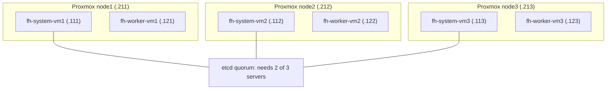
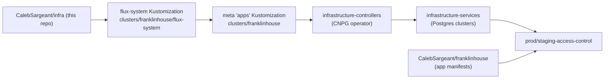

# FranklinHouse cluster

**franklinhouse** is the second Kubernetes cluster managed from this repo: a
3-node Proxmox VE cluster hosting a 6-VM k3s cluster. It is physically and
logically separate from [firefly](cluster-topology.md) — different site,
different subnet (`192.168.69.0/24`), different Flux root, its own Postgres.

Its GitOps config previously lived in the private repo
`calebsargeant/infra-v2` and was folded into this repo on 2026-08-13.

!!! warning "This repo is public"
    infra-v2 was private; this repo is not. Anything moved here is world-visible.
    Secrets must be SOPS-encrypted (`*.enc.yaml`) or projected at runtime via an
    `ExternalSecret` — never committed as plain `data:`/`stringData:`. Base64 is
    encoding, not encryption.

## Physical topology

Three Proxmox hosts, each running exactly one control-plane VM and one worker VM.

| Proxmox host | IP | VMID | VM | VM IP | k3s role |
|---|---|---|---|---|---|
| node1 | 192.168.69.211 | 100 | fh-system-vm1 | 192.168.69.111 | server (control plane) |
| node1 | 192.168.69.211 | 103 | fh-worker-vm1 | 192.168.69.121 | agent |
| node2 | 192.168.69.212 | 101 | fh-system-vm2 | 192.168.69.112 | server (control plane) |
| node2 | 192.168.69.212 | 104 | fh-worker-vm2 | 192.168.69.122 | agent |
| node3 | 192.168.69.213 | 102 | fh-system-vm3 | 192.168.69.113 | server (control plane) |
| node3 | 192.168.69.213 | 105 | fh-worker-vm3 | 192.168.69.123 | agent |



!!! danger "One control-plane VM per Proxmox host"
    Losing a Proxmox host loses a control-plane node. Losing **two** hosts drops
    etcd below quorum and the Kubernetes API stops serving entirely. There is no
    anti-affinity safety margin here — the failure domains are stacked.

**Storage is entirely node-local.** Proxmox uses `local-lvm` (lvmthin) on every
host, plus `mdadm-raid5`/`local-ssd` pinned to node1 and `zfs-raidz1` pinned to
node2. There is no shared storage, which means a VM cannot be live-migrated or
started on a different host, but it also means forcing Proxmox quorum carries no
split-brain data-corruption risk.

Guests are Ubuntu 24.04 with **nested LVM** (`ubuntu-vg/ubuntu-lv` inside GPT
partition 3), `PasswordAuthentication no`, and user `caleb` (uid/gid 1000) with
passwordless sudo.

## k3s node roles

k3s was bootstrapped with `--cluster-init`, so the three servers run **embedded
etcd** and require 2 of 3 for quorum.

| Role | Nodes | Label | Taint |
|---|---|---|---|
| system | fh-system-vm1/2/3 | `node-role=system` | `node-role.kubernetes.io/control-plane=true:NoSchedule` |
| apps | fh-worker-vm1/2/3 | `node-role=apps` | none |

Platform workloads (Flux controllers, Traefik) are pinned to the system nodes,
which requires **both** a `node-role: system` selector and a toleration for the
control-plane taint — see the
`kubernetes/components/node-selectors/franklinhouse-system` component. Selecting
without tolerating produces unschedulable pods.

!!! note "svclb-traefik is not covered"
    Traefik's Deployment is pinned via `HelmChartConfig`, but the k3s service-LB
    helper pods (`svclb-traefik-*`) are a DaemonSet owned by the k3s servicelb
    controller and still run on workers. That is expected.

## Where things live in this repo

```
kubernetes/
  apps/access-control/                    # the app — shared apps tree, repo convention
    base/access-control/                  #   GitRepository + ImageRepositories + deploy-key ExternalSecret
    prod/access-control/                  #   Flux Kustomization + ImagePolicy + ImageUpdateAutomation
    staging/access-control/               #   same, staging
  components/node-selectors/franklinhouse-system/   # nodeSelector + control-plane toleration
  clusters/franklinhouse/
    kustomization.yaml                    # build target of the meta `apps` Kustomization
    apps.yaml                             # the meta `apps` Kustomization itself
    flux-system/                          # bootstrap only: gotk-*, encrypted pull secret
    system/                               # Traefik HelmChartConfig
    infrastructure/                       # cluster-local tiers
      controllers/stack/cloudnative-pg/   #   CNPG operator
      services/stack/postgres/{prod,staging}/  # the CNPG Clusters
ansible/
  hosts.yaml                              # franklinhouse_* inventory groups
  franklinhouse-k3s-bootstrap.yaml        # cluster bootstrap playbook
scripts/bootstrap-franklinhouse-k3s.sh    # wrapper that manages K3S_TOKEN
```

Two scoping decisions are load-bearing:

- `clusters/franklinhouse/kustomization.yaml` references
  **`../../apps/access-control` directly**, not `../../apps`.
  `kubernetes/apps/kustomization.yaml` is *firefly's* app set (~50 apps);
  aggregating it would deploy all of firefly onto franklinhouse.
- franklinhouse's infrastructure tiers are **cluster-local**
  (`clusters/franklinhouse/infrastructure/`) rather than in the shared
  `kubernetes/infrastructure/`. `AGENTS.md` defines that shared tree as
  cluster-agnostic and its tier Kustomizations point at firefly's `stack/`
  paths, whereas franklinhouse runs its own CNPG clusters and Traefik config.

### Postgres is a deliberate exception

`AGENTS.md` says all Postgres goes through one shared CNPG cluster and forbids
new `Cluster` objects. That rule scopes to firefly. franklinhouse is a
physically separate k3s cluster and cannot reach firefly's `postgres` in the
`database` namespace, so it runs its own — the environment-isolation exception
the rule carves out.

## GitOps flow



Note the workload manifests are **not** in this repo — `access-control` is an
external-repo app. This repo holds only the control plane (GitRepository, image
automation, namespaces); the Deployments live in
`CalebSargeant/franklinhouse` under `./access-control/k8s/overlays/<env>`, and
their image tags are bumped there by `ImageUpdateAutomation`.

## Access

| Target | Method |
|---|---|
| Proxmox hosts | `ssh root@192.168.69.21{1,2,3}` — **password auth only**, 1Password item `Proxmox` (Firefly vault). SSH keys are not authorised. |
| k3s VMs | SSH key as `caleb`; `PasswordAuthentication no`. |
| Kubernetes API | `kubectl --context franklinhouse` → `https://192.168.69.113:6443` |

!!! tip "Recovering VM access without guest credentials"
    From a Proxmox host: `qm stop <vmid>`, then
    `losetup -P -f --show /dev/pve/vm-<vmid>-disk-0`, then activate the nested VG
    **scoped to that device** — `vgchange --devices <loopNp3> -ay ubuntu-vg`.
    All guests use the same VG name (`ubuntu-vg`), so an unscoped `vgchange` can
    activate the wrong guest's volume. Mount `ubuntu-lv`, append to
    `/home/caleb/.ssh/authorized_keys`, then unmount, `vgchange -an`,
    `losetup -d`, `qm start`.

## Known risks

These are real, currently-unmitigated, and all three contributed to the
2026-08-13 outage. None is fixed by the migration — fixing them is a behavioural
change, tracked separately.

1. **No database backups.** Neither CNPG `Cluster` has a `.spec.backup` stanza
   and there are no `ScheduledBackup` objects anywhere. The only copy of the
   data is the node-local volumes.
2. **`storageClass: local-path` pins data to nodes.** Each Postgres PVC is bound
   to whichever node first scheduled it. If that node is gone, the volume is
   unreachable and the instance is unschedulable. As of the outage: prod
   `postgres-2`/`postgres-3` and staging `postgres-1` were on fh-worker-vm1
   (node1); prod `postgres-1` on fh-worker-vm2 (node2).
3. **Every node points at `.111` as its join endpoint.** The Ansible bootstrap
   bakes `--server https://<fh-system-vm1>:6443` into each node's systemd unit
   *and* into the agent load-balancer cache at
   `/var/lib/rancher/k3s/agent/etc/k3s-agent-load-balancer.json`. During the
   outage that cache listed only `.112` and `.111` — both dead, `.113` never
   present — so the surviving worker could not rejoin on its own. Consider a VIP
   or DNS name before rebuilding.
4. **No Wake-on-LAN.** No node has a WoL MAC configured, so a dead Proxmox host
   cannot be powered on remotely.

## Recovery: Proxmox loses quorum

Symptom: `cluster not ready - no quorum? (500)` in the Proxmox UI, VMs will not
start, and the node shell/console fails with
`termproxy ... failed waiting for client`. With fewer than 2 of 3 hosts up,
pmxcfs mounts `/etc/pve` **read-only**, and `qm start` needs to write there.

**Before forcing anything**, confirm the other hosts are genuinely down rather
than partitioned — if two hosts are alive and talking to each other, they
already hold quorum and forcing a third creates split brain:

```bash
pvecm status; corosync-cfgtool -s
```

Then, on the surviving host:

```bash
pvecm expected 1
```

This is in-memory only and **reverts on reboot or a corosync restart**, so
complete the work promptly. `/etc/pve` becomes writable immediately and
`qm start <vmid>` works again.

If fewer than 2 control-plane VMs can be started, etcd cannot reach quorum
either. Preferred fix is to revive a Proxmox host. Only if that is impossible,
reset etcd to a single member on a surviving server — this **permanently drops
the other two members**, which must then have `/var/lib/rancher/k3s/server/db`
removed before they can rejoin:

```bash
sudo systemctl stop k3s && sudo k3s server --cluster-reset
```

It prints `Managed etcd cluster membership has been reset` and exits; then
`sudo systemctl start k3s`. Cluster **data is preserved** — only membership
resets. Afterwards, remove the now-stale `--server https://192.168.69.111:6443`
flag from the surviving server's unit, and repoint any surviving worker's
`k3s-agent.service` and load-balancer cache at a live server.

Finally, pods left on dead nodes stay `Running` as phantoms and keep Service
endpoints pointing at unreachable IPs (this is what breaks Flux —
`source-controller` becomes unreachable). Clear them:

```bash
kubectl delete pod -n <ns> <pod> --force --grace-period=0
```

## Cutover from infra-v2

Moving the files here does **not** move the cluster. franklinhouse's Flux still
syncs from `infra-v2` until its `GitRepository` is repointed. To cut over:

1. Ensure this repo's deploy key is attached to `CalebSargeant/infra` and
   readable by franklinhouse's `flux-system` Secret. A Flux deploy key can only
   be attached to one GitHub repo at a time — this bit the original infra-v2
   migration.
2. Ensure the `sops-keys` Secret exists in `flux-system` on franklinhouse; the
   bootstrap Kustomization now sets `decryption.provider: sops` for the
   encrypted pull secret.
3. Apply the updated `gotk-sync.yaml` (url → `CalebSargeant/infra`, path →
   `./kubernetes/clusters/franklinhouse/flux-system`), then
   `flux reconcile source git flux-system -n flux-system`.
4. Archive `calebsargeant/infra-v2` once reconciliation is healthy.

!!! danger "Rotate the GHCR token"
    `ghcr-pull-secret` is SOPS-encrypted here, but the same token sat as plain
    base64 in infra-v2's git history and is therefore compromised. Rotate the PAT
    and re-encrypt:
    `sops kubernetes/clusters/franklinhouse/flux-system/ghcr-pull-secret.enc.yaml`
