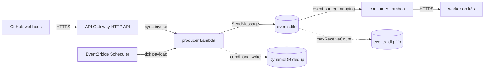

# Terraform (AWS)

<!-- sources: terraform/aws/modules, terraform/aws/prod, terraform/aws/chargate, terraform/aws/brimyr, terraform/root.hcl -->

The AWS estate is the newest of the four clouds in this repo and holds the serverless
front doors: the parts of the fleet that have to answer a webhook in milliseconds and stay
up when the Raspberry Pi doesn't. Everything here is sized to sit inside the AWS free tier.

Terraform state still lives in **GCS**, not S3. Every leaf in the repo, whatever cloud it
targets, inherits the same `remote_state` block from `terraform/root.hcl`, so there's one
state bucket and one backend to reason about. See [Terraform modules](terraform-modules.md)
for the shared wrapper.

## What's deployed



Two of the modules follow that shape. The rest are smaller.

| Module | What it stands up | Used by |
| --- | --- | --- |
| `artifacts` | S3 bucket for published Lambda zips, plus a GitHub OIDC provider and a publish role scoped to one repo and one key prefix. | Every other module, as a dependency |
| `nievah-frontdoor` | `producer` and `consumer` Lambdas, `events`/`jobs` FIFO queues with dead-letter queues, a DynamoDB dedup table, API Gateway, EventBridge Scheduler ticks, budget and alarms. | `prod/eu-west-1/nievah-frontdoor` |
| `caldrith-frontdoor` | Same shape plus a third `reconcile` Lambda. No EventBridge ticks. | `prod/eu-west-1/caldrith-frontdoor` |
| `chargate-broker` | A single `broker` Lambda behind API Gateway, with OIDC-audience auth. No queues, no table. | `chargate/`, `brimyr/` |
| `cost-report` | A scheduled Lambda that reads a BCM data export and posts to Slack via AWS Chatbot. | `prod/eu-west-1/cost-report` |

`brimyr-broker` reuses the `chargate-broker` module rather than duplicating it, so a fix to
the broker reaches both stacks in one change.

## Leaves

Each directory below is one Terragrunt leaf, one state prefix, and one unit of plan and
apply. Apply the `artifacts` leaf in an account before anything that depends on it: the
front doors take the bucket name as a dependency output rather than hardcoding it.

| Leaf | Module |
| --- | --- |
| `terraform/aws/prod/eu-west-1/artifacts` | `artifacts` |
| `terraform/aws/prod/eu-west-1/caldrith-artifacts` | `artifacts` |
| `terraform/aws/prod/eu-west-1/nievah-frontdoor` | `nievah-frontdoor` |
| `terraform/aws/prod/eu-west-1/caldrith-frontdoor` | `caldrith-frontdoor` |
| `terraform/aws/prod/eu-west-1/cost-report` | `cost-report` |
| `terraform/aws/chargate/prod/eu-west-1/artifacts` | `artifacts` |
| `terraform/aws/chargate/prod/eu-west-1/chargate-broker` | `chargate-broker` |
| `terraform/aws/brimyr/prod/eu-west-1/artifacts` | `artifacts` |
| `terraform/aws/brimyr/prod/eu-west-1/brimyr-broker` | `chargate-broker` |

!!! warning "Only two of these are Atlantis projects"
    `atlantis.yaml` lists `aws-artifacts-prod` and `aws-nievah-frontdoor-prod` and nothing
    else from AWS. The other seven leaves are planned by the Terragrunt workflow, which
    discovers leaves from the filesystem. See [Terraform delivery](../operations/terraform-delivery.md).

## Deploying a new Lambda version

The artifact version variable is the deployment. Objects in the artifact bucket are
immutable and keyed by version, so changing the key is the only signal Terraform needs and
no `source_code_hash` appears anywhere in these modules.

```hcl
# terraform/aws/prod/eu-west-1/nievah-frontdoor/terragrunt.hcl
inputs = {
  edge_artifact_version = "1.41.4"
}
```

Merging that change is what moves the front door. The publishing repo's release workflow
uploads the zip and opens the bump pull request here.

## Running against LocalStack

`nievah-frontdoor` and `caldrith-frontdoor` take a `localstack` flag. It isn't cosmetic: it
drops the two resources the free LocalStack image can't honour, and each drop is a real gap
in what a local run proves.

| Resource | On AWS | On LocalStack |
| --- | --- | --- |
| API Gateway HTTP API | Created | Not created. Requests go to a Lambda Function URL instead, same payload format 2.0, so handler routing and signature checks are identical. What isn't covered is API Gateway's own config: the throttle, the `$default` stage, the integration. |
| EventBridge Scheduler | Created | Not created. LocalStack accepts a schedule and never fires it. `terraform/aws/localstack/smoke.py` invokes the producer with a tick payload directly. |

Lambda, SQS FIFO, DynamoDB conditional writes, S3 and IAM all run for real.

## Custom domains are two applies

`enable_custom_domain` defaults to `false` on purpose. Requesting the certificate and using
it are separated by a DNS validation record that lives in a different Terraform state, so
they can't be one apply. Turn it on only once the certificate has reached `ISSUED`. Flipping
it early fails with a `BadRequestException` naming the certificate.

## Module inputs

Every variable below is read from the module's `variables.tf` in this repo. The Effect column
is the first line of the variable's own description. The full rationale, including the traps,
stays in the source next to the code it governs.

### `artifacts`

| Variable | Type | Default | Effect |
| --- | --- | --- | --- |
| `name_prefix` | `string` | `nievah` | Prefix for every resource name here. |
| `publisher_repo` | `string` | `MagmaMoose/nievah` | The ONLY repository allowed to assume the publish role, as `owner/name`. |
| `create_github_oidc_provider` | `bool` | `true` | Create the account's GitHub OIDC provider. |
| `github_oidc_provider_arn` | `string` | `""` | Existing provider ARN, used when create_github_oidc_provider is false. |
| `github_oidc_thumbprints` | `list(string)` | `["6938fd4d98bab03faadb97b34396831e3780aea1"]` | Thumbprints for GitHub's OIDC issuer. |
| `artifact_prefix` | `string` | `edge` | S3 key prefix the publish role may write to and read from, e.g. "edge" or "broker". |

### `nievah-frontdoor`

| Variable | Type | Default | Effect |
| --- | --- | --- | --- |
| `region` | `string` | `eu-west-1` | Region holding the queues, the functions and the table. |
| `environment` | `string` | `prod` | Environment segment of the SSM secret path, e.g. `/nievah/prod/webhook-secret`. |
| `artifact_bucket` | `string` | **required** | Bucket holding the published Lambda zip. |
| `edge_artifact_version` | `string` | **required** | Which published edge zip to run, e.g. "1.41.4". |
| `name_prefix` | `string` | `nievah` | Prefix for every resource name. |
| `localstack` | `bool` | `false` | Target LocalStack rather than AWS. |
| `domain_name` | `string` | `""` | Custom hostname for the front door, e.g. "hooks.magmamoose.com". |
| `enable_custom_domain` | `bool` | `false` | Create the API Gateway custom domain and its API mapping. |
| `certificate_arn` | `string` | `""` | An EXISTING regional ACM certificate to use instead of the one this module requests. |
| `log_retention_days` | `number` | `14` | Lambda log retention. |
| `jobs_retention_seconds` | `number` | `1209600` | How long the jobs queue holds a delivery the cluster has not taken. |
| `stale_jobs_alarm_seconds` | `number` | `900` | Age of the oldest unconsumed job that means the cluster has stopped taking work. |
| `enable_ticks` | `bool` | `false` | Create the EventBridge schedules that replace the two Kubernetes CronJobs. |
| `ops_email` | `string` | `""` | Address subscribed to the ops topic. |
| `slack_workspace_id` | `string` | `""` | AWS Chatbot workspace id, for alarms in Slack. |
| `slack_channel_id` | `string` | `""` | Slack channel id for alarms, e.g. C0123456789. |
| `throttle_rate_limit` | `number` | `2` | Steady-state requests per second the front door will accept, across all callers. |
| `throttle_burst_limit` | `number` | `10` | Instantaneous burst allowed above the rate limit. |
| `monthly_budget_usd` | `number` | `1` | Spend that should never be reached, in USD. |

### `caldrith-frontdoor`

| Variable | Type | Default | Effect |
| --- | --- | --- | --- |
| `region` | `string` | `eu-west-1` | Region holding the queues, the functions and the table. |
| `environment` | `string` | `prod` | Environment segment of the SSM secret path, e.g. `/caldrith/prod/webhook-secret`. |
| `artifact_bucket` | `string` | **required** | Bucket holding the published Lambda zips. |
| `artifact_version` | `string` | **required** | Which published build to run, e.g. "1.15.2". |
| `name_prefix` | `string` | `caldrith` | Prefix for every resource name. |
| `localstack` | `bool` | `false` | Target LocalStack rather than AWS. |
| `domain_name` | `string` | `""` | Custom hostname for the front door, e.g. "hooks-caldrith.magmamoose.com". |
| `enable_custom_domain` | `bool` | `false` | Create the API Gateway custom domain and its API mapping. |
| `certificate_arn` | `string` | `""` | An EXISTING regional ACM certificate to use instead of the one this module requests. |
| `log_retention_days` | `number` | `14` | Log retention for all three functions. |
| `jobs_retention_seconds` | `number` | `1209600` | How long the jobs queue holds work nothing has taken. |
| `stale_jobs_alarm_seconds` | `number` | `900` | Age of the oldest untaken job that means reconciles have stopped happening. |
| `reconcile_timeout_seconds` | `number` | `300` | Wall clock for one reconcile job. |
| `reconcile_memory_mb` | `number` | `1024` | Memory for the reconcile function. |
| `reconcile_max_concurrency` | `number` | `5` | How many reconcile jobs may run at once, capped on the event source mapping. |
| `github_api_url` | `string` | `https://api.github.com` | REST API base URL, passed to the reconcile function as `GITHUB_API_URL`. |
| `admin_repo` | `string` | `admin` | Name of the admin (config) repository holding `.github/settings.yml`, passed through as `ADMIN_REPO`. |
| `ops_email` | `string` | `""` | Address subscribed to the ops topic. |
| `slack_workspace_id` | `string` | `""` | AWS Chatbot workspace id, for alarms in Slack. |
| `slack_channel_id` | `string` | `""` | Slack channel id for alarms, e.g. C0123456789. |
| `throttle_rate_limit` | `number` | `1` | Steady-state requests per second the front door will accept, across all callers. |
| `throttle_burst_limit` | `number` | `5` | Instantaneous burst allowed above the rate limit. |
| `api_flood_alarm_hourly_count` | `number` | `1000` | Requests in one hour that mean something is wrong. |
| `monthly_budget_usd` | `number` | `1` | Spend that should never be reached, in USD. |

### `chargate-broker`

| Variable | Type | Default | Effect |
| --- | --- | --- | --- |
| `region` | `string` | `eu-west-1` | Region holding the function, the API and the parameters. |
| `environment` | `string` | `prod` | Environment segment of the SSM secret path, e.g. `/chargate/prod/app-id`. |
| `name_prefix` | `string` | `chargate` | Prefix for every resource name. |
| `oidc_audience` | `string` | `""` | The OIDC `aud` the calling workflow asks GitHub for, which this broker then requires. |
| `artifact_bucket` | `string` | **required** | Bucket holding the published Lambda zip. |
| `artifact_prefix` | `string` | `broker` | Key prefix inside the artifact bucket. |
| `broker_artifact_version` | `string` | **required** | Which published zip to run, e.g. "2.12.0". |
| `domain_name` | `string` | `""` | Custom hostname for the broker, e.g. "broker-chargate.magmamoose.com". |
| `enable_custom_domain` | `bool` | `false` | Create the API Gateway custom domain and its API mapping. |
| `certificate_arn` | `string` | `""` | An EXISTING regional ACM certificate to use instead of the one this module requests. |
| `disable_default_endpoint` | `bool` | `false` | Turn off the API's own `*.execute-api.<region>.amazonaws.com` hostname, making the custom domain the only way in. |
| `log_retention_days` | `number` | `14` | Lambda log retention. |
| `throttle_rate_limit` | `number` | `2` | Steady-state requests per second the front door will accept, across all callers. |
| `throttle_burst_limit` | `number` | `10` | Instantaneous burst above the rate limit. |
| `memory_size` | `number` | `1024` | Chosen for COLD START rather than steady state: Lambda scales CPU with memory, and this function imports `cryptography` (a multi-megabyte compiled extension) before it can do anything. |
| `timeout` | `number` | `15` | Two transatlantic GitHub round trips (installation lookup, then mint) plus a possible JWKS fetch on a cold isolate. |
| `ops_email` | `string` | `""` | Address subscribed to the ops topic. |
| `slack_workspace_id` | `string` | `""` | AWS Chatbot workspace id, for alarms in Slack. |
| `slack_channel_id` | `string` | `""` | Slack channel id for alarms, e.g. C0123456789. |
| `busy_alarm_requests_per_15min` | `number` | `100` | Requests in 15 minutes that mean something is wrong. |
| `monthly_budget_usd` | `number` | `1` | Spend that should never be reached, in USD. |
| `additional_domain_names` | `list(string)` | `[]` | Extra hostnames this API also answers on, each with its own ACM certificate, custom domain and mapping. |

### `cost-report`

| Variable | Type | Default | Effect |
| --- | --- | --- | --- |
| `name_prefix` | `string` | `mm-cost-report` | Prefix for every resource this module creates. |
| `region` | `string` | **required** | Region the schedule, function and topic live in. |
| `environment` | `string` | **required** | Terragrunt environment name, used only for tagging and naming. |
| `schedule_expression` | `string` | `cron(0 7 * * ? *)` | When the report fires. |
| `schedule_timezone` | `string` | `UTC` | IANA timezone the schedule is interpreted in. |
| `slack_workspace_id` | `string` | `""` | Slack workspace (team) id, from the AWS Chatbot console. |
| `slack_channel_id` | `string` | `""` | Slack channel id to post into. |
| `log_retention_days` | `number` | `30` | CloudWatch Logs retention. |
| `export_prefix` | `string` | `cur` | Key prefix inside the export bucket. |
| `export_retention_days` | `number` | `95` | Lifecycle expiry for export objects. |
| `monthly_budget_usd` | `number` | `5` | Budget guard for the whole organisation's consolidated spend, in USD. |
